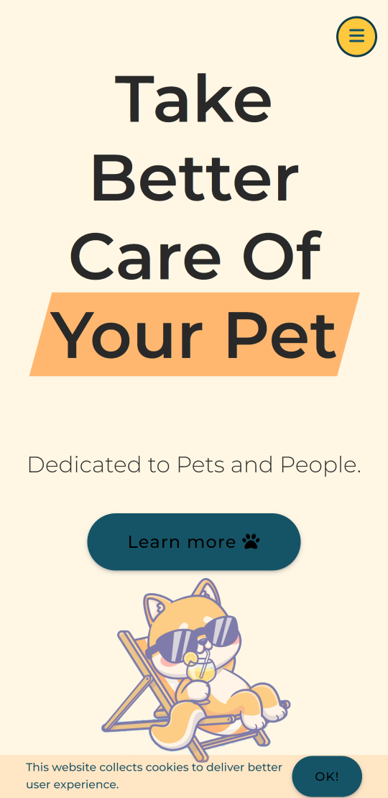
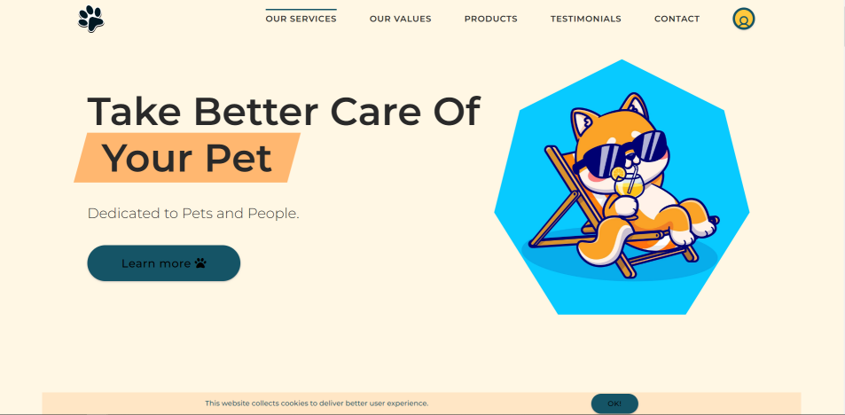

# 宠物护理网站

这是一个宠物护理网站,是我在学习 Jonas Schmedtmann 的课程后制作的。
最初我只是想练习课程内容。最终,我制作了自己的网站版本并添加了一些内容。
在课程中,网站并不是响应式的,这就是为什么我从桌面视图开始(通常我使用"移动优先"原则)。

### 项目总结/观察

- 我为完成这个项目感到非常自豪。我花了一些时间在上面。我详细分析了项目中的代码(特别是 CSS),并在我的项目中使用了它。我学会了更好地在 CSS 中使用类命名。我以前没有使用过 BEM,所以我的类名有时很混乱。这很有帮助。
- 我很清楚我的代码太长了。我应该在这里使用 SASS/SCSS,而不是纯 CSS。这样可以缩短代码(但如前所述,我最初只是想练习,而不是做整个页面...)
- 应该从移动视图开始。从桌面到移动的过渡给我带来了问题。这并不完美,但我没有过多关注它。

## 页面包含:

- 屏幕过渡
- 评价轮播
- 标签组件  
- 图片懒加载
- 模态窗口(登录/注册表单,联系表单)
- 粘性导航
- 返回顶部按钮
- 所有交互元素的悬停状态
- 根据设备屏幕大小的最佳布局

## 截图

## 演示

- 实时网站 URL: [实时演示](https://xakashax.github.io/pet-care-website/)

## 构建使用

- 语义化 HTML5 标记
- CSS3
- 伪元素
- Flexbox 和 Grid
- 桌面优先工作流程
- JS
- Photoshop

## 照片

- 所有图片均来自 freepik.com [@catalyststuff](https://www.freepik.com/author/catalyststuff)
